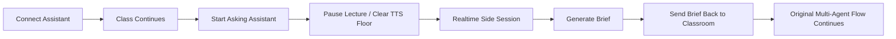
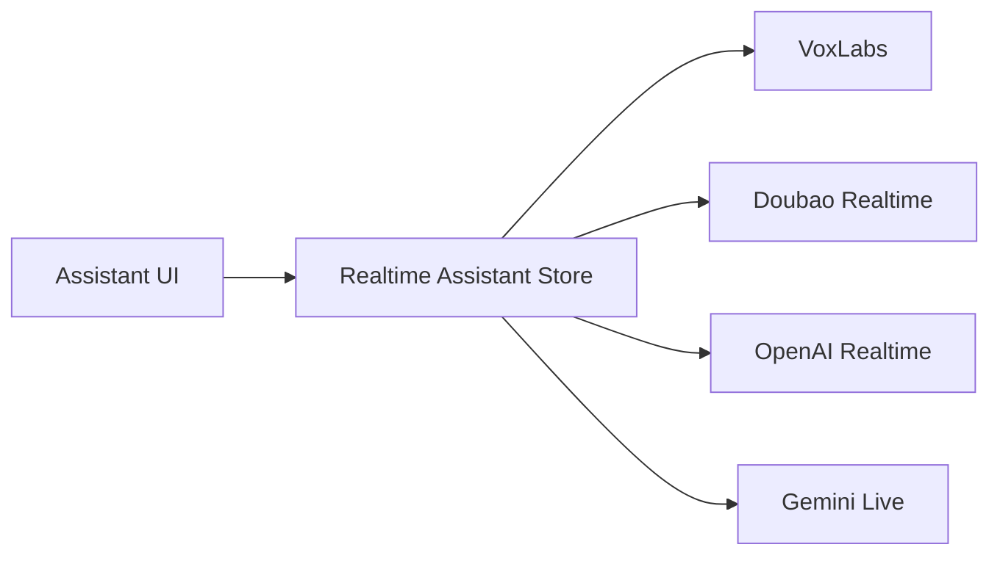

<p align="center">
  
</p>

<h1 align="center">OpenMAIC + 实时语音助教</h1>


<p align="center">
  把 OpenMAIC 的多智能体课堂，与超低延迟实时语音能力，重构成一个更像“私人助教”的课堂交互层。
</p>

<p align="center">
  <a href="LICENSE"></a>
  
  
  
  
  
</p>

<p align="center">
  <a href="./public/openmaic-brief-introduce.html">Visual Brief</a> ·
  <a href="#what-this-fork-does">What This Fork Does</a> ·
  <a href="#interaction-loop">Interaction Loop</a> ·
  <a href="#technical-design">Technical Design</a> ·
  <a href="#quick-start">Quick Start</a>
</p>

---

## Why this fork

Upstream **OpenMAIC** is already strong at one thing: generating and running a rich multi-agent classroom with slides, quizzes, whiteboard explanations, and live discussions.

This fork focuses on a different problem:

> How do you add **realtime voice** to a multi-agent classroom **without breaking the classroom itself**?

The answer in this repo is not "make realtime voice another teacher".

The answer is:

- keep the original classroom orchestration intact
- add a **realtime teaching assistant** as a side session
- pause the classroom only when needed
- turn the side conversation into a **brief**
- hand the brief back to the original classroom flow

That makes realtime voice feel like a **private TA** rather than a second classroom engine fighting for control.

---

## What This Fork Does

<table>
<tr>
<td width="50%" valign="top">

### Business layer

- Repositions realtime voice from a customer-service style WS bot into a **classroom teaching assistant**
- Changes the user mental model from "voice plugin" to **"请教助教"**
- Makes mode switching explicit:
  - connect assistant
  - start asking assistant
  - end asking and return to class

</td>
<td width="50%" valign="top">

### Product layer

- Adds a **floating draggable assistant panel**
- Removes noisy latency UI
- Adds stronger mode semantics:
  - `课程继续中`
  - `课堂已暂停`
  - `结束请教，回到课堂`
- Makes the assistant panel behave like a real classroom tool window instead of a hidden debug control

</td>
</tr>
<tr>
<td width="50%" valign="top">

### Technical layer

- Adds a dedicated **voice floor state machine**
- Gates lecture / discussion callbacks while assistant mode owns the floor
- Flushes conflicting classroom TTS before assistant session starts
- Adds transcript snapshot + `voice-brief` handoff API

</td>
<td width="50%" valign="top">

### Platform layer

- Introduces a **realtime-assistant provider abstraction**
- Supports a normalized provider model for:
  - `VoxLabs`
  - `Doubao Realtime`
  - `OpenAI Realtime`
  - `Gemini Live`
- Adds `session_config` and `update_context` support so the server can inject prompt + course context

</td>
</tr>
</table>

---

## Interaction Loop



### Key point

The realtime layer does **not** replace the classroom.

It temporarily opens a side channel, then hands the result back to the original OpenMAIC chat / classroom pipeline.

---

## Technical Design

```mermaid
flowchart TB
    subgraph Classroom Core
        A[Playback Engine]
        B[Roundtable / Discussion SSE]
        C[Discussion TTS Queue]
        D[Teacher / Student Orchestration]
    end

    subgraph Realtime Assistant Overlay
        E[Stage voiceFloorState]
        F[VoxLabsVoicePanel]
        G[useVoxLabsVoice]
        H[/api/voice-brief]
        I[Realtime Provider Registry]
    end

    A --> E
    B --> E
    C --> E
    D --> E
    E --> F
    F --> G
    G --> H
    G --> I
    H --> B
```

### What was added

- `Stage` becomes the coordinator for assistant mode lifecycle
- `useVoxLabsVoice` keeps local transcript + pending response preview
- `/api/voice-brief` converts side-session transcript into one classroom-safe message
- provider config is no longer hardcoded to VoxLabs only

### What was intentionally preserved

- original teacher / student discussion logic
- classroom SSE streaming structure
- roundtable interaction model
- playback engine main orchestration
- discussion TTS queue semantics

This fork adds an **overlay**, not a rewrite.

---

## Slide-Aware Assistant Context

One important change in this fork is that the realtime assistant is no longer context-blind.

After connection, the client can send:

- `session_config`
- `update_context`

That lets the server-side assistant receive:

- a custom `system_prompt`
- current course title
- current chapter title
- current page index
- current slide speech summary

So the assistant can answer like:

> "the TA for *this* lesson, on *this* slide"

instead of:

> "a generic voice bot with no classroom grounding"

### Protocol sketch

```json
{"type":"session_config","system_prompt":"你是这节课的AI助教...","context":"当前章节：自注意力机制","max_tokens":120}
```

```json
{"type":"update_context","context":"当前章节：多头注意力，slide内容：将注意力分为多个头..."}
```

---

## Provider Direction

This fork introduces a normalized realtime assistant surface on the frontend.



### Why this matters

It prevents the UI and state model from being locked to a single vendor.

The frontend can now choose a provider, while the backend is free to evolve toward:

- direct WS endpoints
- unified relays / gateways
- auth and quota enforcement
- per-user assistant sessions

---

## Screens

### Multi-agent classroom still stays central


### Realtime voice is now framed as a teaching assistant overlay

- private ask flow
- explicit mode switching
- classroom-safe handoff
- context-aware response path

---

## Quick Start

### 1. Clone

```bash
git clone https://github.com/HenryZ838978/OpenMAIC-VoiceSupport.git
cd OpenMAIC-VoiceSupport
pnpm install
```

### 2. Configure

```bash
cp .env.example .env.local
```

Fill in at least one LLM provider key, for example:

```env
OPENAI_API_KEY=sk-...
GOOGLE_API_KEY=...
ANTHROPIC_API_KEY=...
```

If you also want to use server-side provider config:

```yaml
providers:
  openai:
    apiKey: sk-...
```

### 3. Run

```bash
pnpm dev
```

Then open:

- `http://localhost:3000`
- optional visual brief: `http://localhost:3000/openmaic-brief-introduce.html`

---

## Current Focus

This fork is especially opinionated about one direction:

### `OpenMAIC + 实时语音助教`

Not:

- "ASR only"
- "just add VAD"
- "make the whole classroom instant"

But:

- preserve classroom quality
- add realtime voice where it truly helps
- make it feel like a personal teaching assistant
- keep the architecture extensible enough for future relay / auth / subscription layers

---

## Roadmap

- richer per-slide context extraction
- custom assistant prompt UI in settings
- stronger server-side grounding / retrieval
- per-user assistant sessions
- vendor-specific relay implementations
- auth / billing / SDK packaging

---

## Upstream & Credits

This repository is forked from **THU-MAIC/OpenMAIC** and builds on top of the original multi-agent classroom architecture.

- Upstream project: <https://github.com/THU-MAIC/OpenMAIC>
- This fork: <https://github.com/HenryZ838978/OpenMAIC-VoiceSupport>

The original OpenMAIC team solved the multi-agent classroom problem.

This fork explores the next layer:

> **how realtime voice can become a proper teaching assistant inside that classroom.**

---

## License

This project remains licensed under the [GNU Affero General Public License v3.0](LICENSE).

